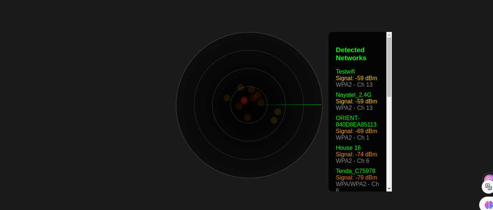
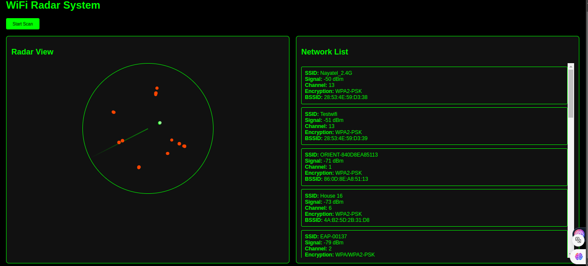
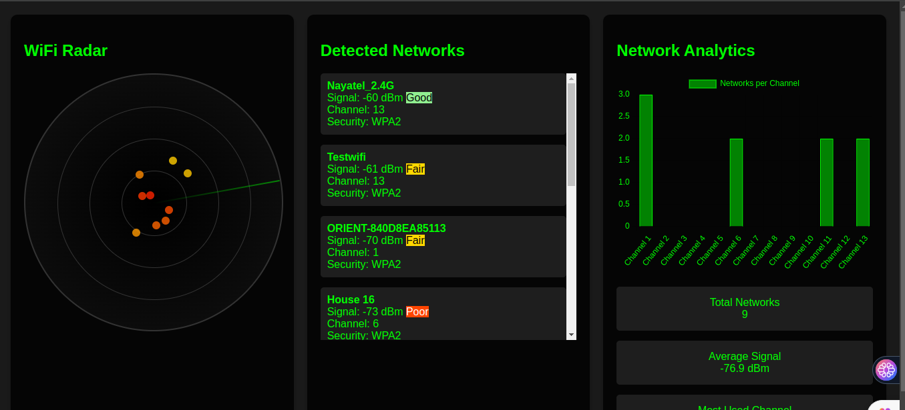
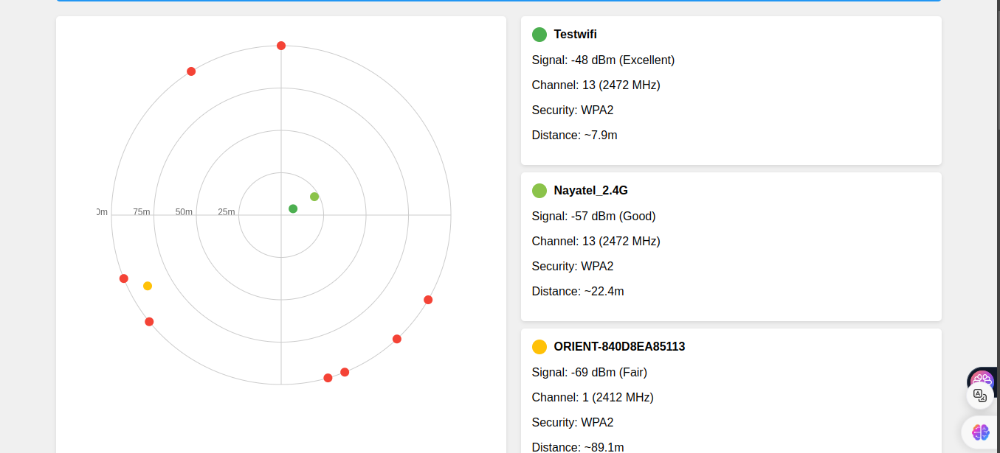
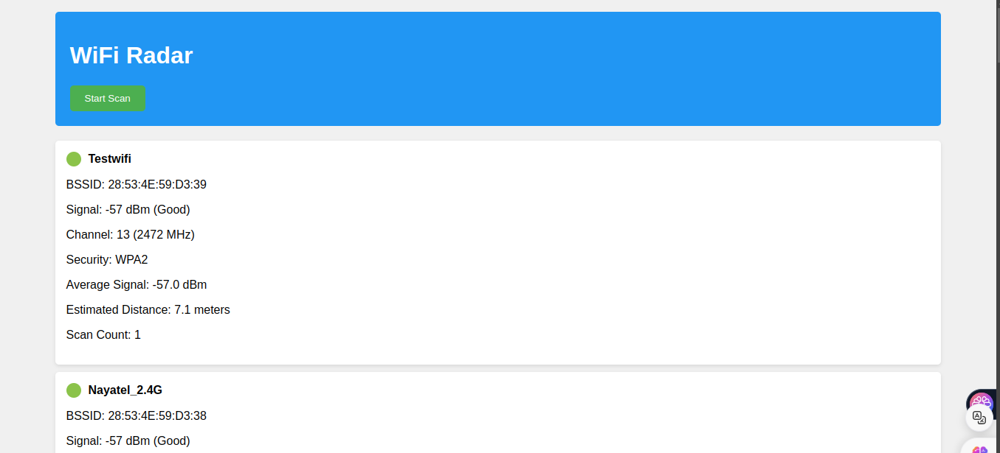

# WiFi Radar System

This project is a WiFi Radar System built using an ESP32 microcontroller. It scans for nearby WiFi networks, collects information about them, and visualizes the data in various formats. The project includes multiple implementations with different styles and functionalities.

## Table of Contents

- Overview
- Features
- [Project Structure](#project-structure)
- [Setup and Installation](#setup-and-installation)
- Usage
- [Code Explanation](#code-explanation)
  - [Simple Implementation](#simple-implementation)
  - [Different with Radar Implementation](#different-with-radar-implementation)
  - [Different Style Implementation](#different-style-implementation)
  - [Advanced Implementation](#advanced-implementation)
  - [Added Structure Implementation](#added-structure-implementation)
- Contributing
- License

## Overview

The WiFi Radar System scans for WiFi networks and displays the results in a web interface. The project demonstrates various ways to visualize WiFi network data, including radar views, network lists, and analytics charts.

## Features

- Scans for nearby WiFi networks
- Displays network information such as SSID, signal strength, encryption type, and channel
- Visualizes network data in different styles
- Provides a web interface for easy access and interaction

## Project Structure

```
.gitignore
.pio/
.vscode/
include/
lib/
src/
test/
platformio.ini
readme.md
```

## Setup and Installation

1. **Clone the repository:**
   ```sh
   git clone https://github.com/yourusername/wifi-radar-system.git
   cd wifi-radar-system
   ```

2. **Install PlatformIO:**
   Follow the instructions on the [PlatformIO website](https://platformio.org/install) to install PlatformIO.

3. **Open the project in VSCode:**
   ```sh
   code .
   ```

4. **Build and upload the project:**
   Use the PlatformIO extension in VSCode to build and upload the project to your ESP32 board.

## Usage

1. **Connect to the ESP32 Access Point:**
   After uploading the code, connect to the WiFi network named `WiFi-Radar` or `ESP32-WIFI-RADAR`.

2. **Open the web interface:**
   Open a web browser and navigate to the IP address of the ESP32 (usually `192.168.4.1`).

3. **Start scanning:**
   Use the web interface to start scanning for WiFi networks and view the results.

## Code Explanation

### Simple Implementation

The [simple.ino](include/examples/simple.ino) file provides a basic implementation of the WiFi Radar System. It includes a simple web interface with a radar view and a network list.

```cpp
#include <WiFi.h>
#include <WebServer.h>
#include <ArduinoJson.h>

// Web server running on port 80
WebServer server(80);

// HTML content stored in PROGMEM to save RAM
const char index_html[] PROGMEM = R"rawliteral(
<!DOCTYPE html>
<html lang="en">
<head>
    <meta charset="UTF-8">
    <meta name="viewport" content="width=device-width, initial-scale=1.0">
    <title>WiFi Signal Radar</title>
    <style>
        /* CSS styles */
    </style>
</head>
<body>
    <!-- HTML content -->
    <script>
        // JavaScript code
    </script>
</body>
</html>
)rawliteral";

// Function to handle the root URL
void handleRoot() {
    server.send(200, "text/html", index_html);
}

// Function to handle WiFi scan requests
void handleScan() {
    // JSON document to store network data
    StaticJsonDocument<4096> doc;
    JsonArray networks = doc.to<JsonArray>();

    int numNetworks = WiFi.scanNetworks();
    if (numNetworks > 0) {
        for (int i = 0; i < numNetworks; i++) {
            JsonObject network = networks.createNestedObject();
            network["ssid"] = WiFi.SSID(i);
            network["signal"] = WiFi.RSSI(i);
            network["encryption"] = encryptionType(WiFi.encryptionType(i));
            network["channel"] = WiFi.channel(i);
        }
    }

    String response;
    serializeJson(doc, response);
    server.send(200, "application/json", response);
    WiFi.scanDelete();
}

// Setup function
void setup() {
    Serial.begin(115200);
    WiFi.softAP("ESP32-WIFI-RADAR", "");
    server.on("/", handleRoot);
    server.on("/scan", handleScan);
    server.begin();
}

// Loop function
void loop() {
    server.handleClient();
}
```


### Added Structure Implementation

The [added structure.ino](include/examples/added%20structure.ino) file provides an implementation with a structured approach to organizing network data and visualizing it.

```cpp
#include <WiFi.h>
#include <WebServer.h>
#include <ArduinoJson.h>

// Web server running on port 80
WebServer server(80);

// Network information structure
struct NetworkInfo {
    String ssid;
    String bssid;
    int32_t signal;
    String encryption;
    uint8_t channel;
    unsigned long lastSeen;
    double distance;
};

// Vector to store network information
std::vector<NetworkInfo> networks;

// HTML content stored in PROGMEM to save RAM
const char index_html[] PROGMEM = R"rawliteral(
<!DOCTYPE HTML>
<html>
<head>
    <meta name="viewport" content="width=device-width, initial-scale=1">
    <style>
        /* CSS styles */
    </style>
</head>
<body>
    <!-- HTML content -->
    <script>
        // JavaScript code
    </script>
</body>
</html>
)rawliteral";

// Function to handle the root URL
void handleRoot() {
    server.send(200, "text/html", index_html);
}

// Function to handle WiFi scan requests
void handleScan() {
    int n = WiFi.scanNetworks();
    networks.clear();
    if (n > 0) {
        for (int i = 0; i < n; ++i) {
            NetworkInfo network;
            network.ssid = WiFi.SSID(i);
            network.bssid = WiFi.BSSIDstr(i);
            network.signal = WiFi.RSSI(i);
            network.encryption = getEncryptionType(WiFi.encryptionType(i));
            network.channel = WiFi.channel(i);
            network.lastSeen = millis();
            network.distance = calculateDistance(network.signal);
            networks.push_back(network);
        }
    }

    String jsonString = "[";
    for (size_t i = 0; i < networks.size(); i++) {
        if (i > 0) jsonString += ",";
        jsonString += "{";
        jsonString += "\"ssid\":\"" + networks[i].ssid + "\",";
        jsonString += "\"bssid\":\"" + networks[i].bssid + "\",";
        jsonString += "\"signal\":" + String(networks[i].signal) + ",";
        jsonString += "\"encryption\":\"" + networks[i].encryption + "\",";
        jsonString += "\"channel\":" + String(networks[i].channel) + ",";
        jsonString += "\"distance\":" + String(networks[i].distance);
        jsonString += "}";
    }
    jsonString += "]";

    server.send(200, "application/json", jsonString);
}

// Setup function
void setup() {
    Serial.begin(115200);
    WiFi.mode(WIFI_AP_STA);
    WiFi.softAP("WiFi-Radar", "");
    Serial.print("AP IP address: ");
    Serial.println(WiFi.softAPIP());
    server.on("/", handleRoot);
    server.on("/scan", handleScan);
    server.begin();
    Serial.println("HTTP server started#include <WiFi.h>
#include <WebServer.h>
#include <ArduinoJson.h>

// Web server running on port 80
WebServer server(80);

// Network information structure
struct NetworkInfo {
    String ssid;
    String bssid;
    int32_t signal;
    String encryption;
    uint8_t channel;
    unsigned long lastSeen;
    double distance;
};

// Vector to store network information
std::vector<NetworkInfo> networks;

// HTML content stored in PROGMEM to save RAM
const char index_html[] PROGMEM = R"rawliteral(
<!DOCTYPE HTML>
<html>
<head>
    <meta name="viewport" content="width=device-width, initial-scale=1">
    <style>
        /* CSS styles */
    </style>
</head>
<body>
    <!-- HTML content -->
    <script>
        // JavaScript code
    </script>
</body>
</html>
)rawliteral";

// Function to handle the root URL
void handleRoot() {
    server.send(200, "text/html", index_html);
}

// Function to handle WiFi scan requests
void handleScan() {
    int n = WiFi.scanNetworks();
    networks.clear();
    if (n > 0) {
        for (int i = 0; i < n; ++i) {
            NetworkInfo network;
            network.ssid = WiFi.SSID(i);
            network.bssid = WiFi.BSSIDstr(i);
            network.signal = WiFi.RSSI(i);
            network.encryption = getEncryptionType(WiFi.encryptionType(i));
            network.channel = WiFi.channel(i);
            network.lastSeen = millis();
            network.distance = calculateDistance(network.signal);
            networks.push_back(network);
        }
    }

    String jsonString = "[";
    for (size_t i = 0; i < networks.size(); i++) {
        if (i > 0) jsonString += ",";
        jsonString += "{";
        jsonString += "\"ssid\":\"" + networks[i].ssid + "\",";
        jsonString += "\"bssid\":\"" + networks[i].bssid + "\",";
        jsonString += "\"signal\":" + String(networks[i].signal) + ",";
        jsonString += "\"encryption\":\"" + networks[i].encryption + "\",";
        jsonString += "\"channel\":" + String(networks[i].channel) + ",";
        jsonString += "\"distance\":" + String(networks[i].distance);
        jsonString += "}";
    }
    jsonString += "]";

    server.send(200, "application/json", jsonString);
}

// Setup function
void setup() {
    Serial.begin(115200);
    WiFi.mode(WIFI_AP_STA);
    WiFi.softAP("WiFi-Radar", "");
    Serial.print("AP IP address: ");
    Serial.println(WiFi.softAPIP());
    server.on("/", handleRoot);
    server.on("/scan", handleScan);
    server.begin();
    Serial.println("HTTP server started");
    for (int i = 0; i < n; ++i) {
        NetworkInfo network;
        network.ssid = WiFi.SSID(i);
        network.bssid = WiFi.BSSIDstr(i);
        network.signal = WiFi.RSSI(i);
        network.encryption = getEncryptionType(WiFi.encryptionType(i));
        network.channel = WiFi.channel(i);
        network.lastSeen = millis();
        network.distance = calculateDistance(network.signal);
        networks.push_back(network);
    }
}

    String jsonString = "[";
    for (size_t i = 0; i < networks.size(); i++) {
        if (i > 0) jsonString += ",";
        jsonString += "{";
        jsonString += "\"ssid\":\"" + networks[i].ssid + "\",";
        jsonString += "\"bssid\":\"" + networks[i].bssid + "\",";
        jsonString += "\"signal\":" + String(networks[i].signal) + ",";
        jsonString += "\"encryption\":\"" + networks[i].encryption + "\",";
        jsonString += "\"channel\":" + String(networks[i].channel) + ",";
        jsonString += "\"distance\":" + String(networks[i].distance);
        jsonString += "}";
    }
    jsonString += "]";

    server.send(200, "application/json", jsonString);
}

// Setup function
void setup() {
    Serial.begin(115200);
    WiFi.mode(WIFI_AP_STA);
    WiFi.softAP("WiFi-Radar", "");
    Serial.print("AP IP address: ");
    Serial.println(WiFi.softAPIP());
    server.on("/", handleRoot);
    server.on("/scan", handleScan);
    server.begin();
    Serial.println("HTTP server started");
}

// Loop function
void loop() {
    server.handleClient();
}


```


### Advanced Implementation

The [advanced.ino](include/examples/advanced.ino) file provides an advanced implementation with additional features such as analytics charts and detailed network statistics.

```cpp
#include <WiFi.h>
#include <WebServer.h>
#include <ArduinoJson.h>

// Web server running on port 80
WebServer server(80);

// Network information structure
struct NetworkInfo {
    String ssid;
    int signal;
    float avgSignal;
    String encryption;
    int channel;
    int scanCount;
    unsigned long firstSeen;
    unsigned long lastSeen;
    std::vector<int> signalHistory;
    bool isHidden;
    String bssid;
    int frequency;
};

// Vector to store network information
std::vector<NetworkInfo> networksList;

// HTML content stored in PROGMEM to save RAM
const char index_html[] PROGMEM = R"rawliteral(
<!DOCTYPE html>
<html lang="en">
<head>
    <meta charset="UTF-8">
    <meta name="viewport" content="width=device-width, initial-scale=1.0">
    <title>WiFi Radar System</title>
    <script src="https://cdnjs.cloudflare.com/ajax/libs/Chart.js/3.9.1/chart.min.js"></script>
    <style>
        /* CSS styles */
    </style>
</head>
<body>
    <!-- HTML content -->
    <script>
        // JavaScript code
    </script>
</body>
</html>
)rawliteral";

// Function to handle the root URL
void handleRoot() {
    server.send(200, "text/html", index_html);
}

// Function to handle WiFi scan requests
void handleScan() {
    // JSON document to store network data
    StaticJsonDocument<16384> doc;
    JsonArray networks = doc.createNestedArray("networks");

    int numNetworks = WiFi.scanNetworks(false, true, false, 300);
    if (numNetworks > 0) {
        for (int i = 0; i < numNetworks; i++) {
            String ssid = WiFi.SSID(i);
            String bssid = WiFi.BSSIDstr(i);
            int signal = WiFi.RSSI(i);
            int channel = WiFi.channel(i);
            wifi_auth_mode_t encryption = WiFi.encryptionType(i);
            NetworkInfo* network = findOrCreateNetwork(ssid, bssid);
            updateSignalStability(network, signal);
            network->frequency = calculateFrequency(channel).toInt();
            network->ssid = ssid;
            network->signal = signal;
            network->encryption = getSecurityAnalysis(encryption);
            network->channel = channel;
            network->isHidden = ssid.isEmpty();
            network->lastSeen = millis();

            JsonObject networkObj = networks.createNestedObject();
            networkObj["ssid"] = network->ssid;
            networkObj["signal"] = network->signal;
            networkObj["avgSignal"] = network->avgSignal;
            networkObj["encryption"] = network->encryption;
            networkObj["channel"] = network->channel;
            networkObj["isHidden"] = network->isHidden;
            networkObj["bssid"] = network->bssid;
            networkObj["frequency"] = network->frequency;
            networkObj["signalQuality"] = getSignalQuality(network->signal);
        }
    }

    String response;
    serializeJson(doc, response);
    server.send(200, "application/json", response);
}

// Setup function
void setup() {
    Serial.begin(115200);
    WiFi.mode(WIFI_AP);
    delay(100);
    WiFi.softAP("radar");
    IPAddress IP = WiFi.softAPIP();
    Serial.print("Access Point \"radar\" started. IP address: ");
    Serial.println(IP);
    server.on("/", handleRoot);
    server.on("/scan", handleScan);
    server.begin();
    Serial.println("WiFi Radar System initialized");
}

// Loop function
void loop() {
    server.handleClient();
}


```


### Different with Radar Implementation

The [different with radar.ino](include/examples/different%20with%20radar.ino) file provides an implementation with a radar view and additional network information.

```cpp
#include <WiFi.h>
#include <WebServer.h>
#include <ArduinoJson.h>

// Web server running on port 80
WebServer server(80);

// Network information structure
struct NetworkInfo {
    String ssid;
    int signal;
    float avgSignal;
    String encryption;
    int channel;
    int scanCount;
    unsigned long firstSeen;
    unsigned long lastSeen;
    std::vector<int> signalHistory;
    bool isHidden;
    String bssid;
    int frequency;
};

// Vector to store network information
std::vector<NetworkInfo> networksList;

// HTML content stored in PROGMEM to save RAM
const char index_html[] PROGMEM = R"rawliteral(
<!DOCTYPE HTML>
<html>
<head>
    <title>WiFi Radar</title>
    <meta name="viewport" content="width=device-width, initial-scale=1">
    <style>
        /* CSS styles */
    </style>
</head>
<body>
    <!-- HTML content -->
    <script>
        // JavaScript code
    </script>
</body>
</html>
)rawliteral";

// Function to handle the root URL
void handleRoot() {
    server.send(200, "text/html", index_html);
}

// Function to handle WiFi scan requests
void handleScan() {
    // JSON document to store network data
    StaticJsonDocument<32768> doc;
    JsonArray networks = doc.createNestedArray("networks");

    int numNetworks = WiFi.scanNetworks(false, true);
    if (numNetworks > 0) {
        for (int i = 0; i < numNetworks; i++) {
            String ssid = WiFi.SSID(i);
            String bssid = WiFi.BSSIDstr(i);
            NetworkInfo* network = findOrCreateNetwork(ssid, bssid);
            network->signal = WiFi.RSSI(i);
            network->encryption = getSecurityAnalysis(WiFi.encryptionType(i));
            network->channel = WiFi.channel(i);
            network->isHidden = ssid.length() == 0;
            network->frequency = calculateFrequency(network->channel).toInt();
            updateSignalStability(network, network->signal);

            JsonObject networkObj = networks.createNestedObject();
            networkObj["ssid"] = network->isHidden ? "<Hidden Network>" : network->ssid;
            networkObj["bssid"] = network->bssid;
            networkObj["signal"] = network->signal;
            networkObj["signalQuality"] = getSignalQuality(network->signal);
            networkObj["encryption"] = network->encryption;
            networkObj["channel"] = network->channel;
            networkObj["frequency"] = network->frequency;
            networkObj["distance"] = calculateDistance(network->signal);
            networkObj["avgSignal"] = network->avgSignal;
            networkObj["scanCount"] = network->scanCount;
            networkObj["firstSeen"] = network->firstSeen;
            networkObj["lastSeen"] = network->lastSeen;
        }
    }

    String response;
    serializeJson(doc, response);
    server.send(200, "application/json", response);
    WiFi.scanDelete();
}

// Setup function
void setup() {
    Serial.begin(115200);
    WiFi.disconnect(true);
    delay(1000);
    WiFi.mode(WIFI_AP_STA);
    WiFi.softAP("WiFi_Radar", "12345678");
    server.on("/", HTTP_GET, handleRoot);
    server.on("/scan", HTTP_GET, handleScan);
    server.begin();
}

// Loop function
void loop() {
    server.handleClient();
}
```


### Different Style Implementation

The [different style.ino](include/examples/different%20style.ino) file provides an implementation with a different visual style for the web interface.

```cpp
#include <WiFi.h>
#include <WebServer.h>
#include <ArduinoJson.h>

// Web server running on port 80
WebServer server(80);

// Network information structure
struct NetworkInfo {
    String ssid;
    int signal;
    float avgSignal;
    String encryption;
    int channel;
    int scanCount;
    unsigned long firstSeen;
    unsigned long lastSeen;
    std::vector<int> signalHistory;
    bool isHidden;
    String bssid;
    int frequency;
};

// Vector to store network information
std::vector<NetworkInfo> networksList;

// HTML content stored in PROGMEM to save RAM
const char index_html[] PROGMEM = R"rawliteral(
<!DOCTYPE HTML>
<html>
<head>
    <title>WiFi Radar</title>
    <meta name="viewport" content="width=device-width, initial-scale=1">
    <style>
        /* CSS styles */
    </style>
</head>
<body>
    <!-- HTML content -->
    <script>
        // JavaScript code
    </script>
</body>
</html>
)rawliteral";

// Function to handle the root URL
void handleRoot() {
    server.send(200, "text/html", index_html);
}

// Function to handle WiFi scan requests
void handleScan() {
    // JSON document to store network data
    StaticJsonDocument<32768> doc;
    JsonArray networks = doc.createNestedArray("networks");

    int numNetworks = WiFi.scanNetworks(false, true);
    if (numNetworks > 0) {
        for (int i = 0; i < numNetworks; i++) {
            String ssid = WiFi.SSID(i);
            String bssid = WiFi.BSSIDstr(i);
            NetworkInfo* network = findOrCreateNetwork(ssid, bssid);
            network->signal = WiFi.RSSI(i);
            network->encryption = getSecurityAnalysis(WiFi.encryptionType(i));
            network->channel = WiFi.channel(i);
            network->isHidden = ssid.length() == 0;
            network->frequency = calculateFrequency(network->channel).toInt();
            updateSignalStability(network, network->signal);

            JsonObject networkObj = networks.createNestedObject();
            networkObj["ssid"] = network->isHidden ? "<Hidden Network>" : network->ssid;
            networkObj["bssid"] = network->bssid;
            networkObj["signal"] = network->signal;
            networkObj["signalQuality"] = getSignalQuality(network->signal);
            networkObj["encryption"] = network->encryption;
            networkObj["channel"] = network->channel;
            networkObj["frequency"] = network->frequency;
            networkObj["distance"] = calculateDistance(network->signal);
            networkObj["avgSignal"] = network->avgSignal;
            networkObj["scanCount"] = network->scanCount;
            networkObj["firstSeen"] = network->firstSeen;
            networkObj["lastSeen"] = network->lastSeen;
        }
    }

    String response;
    serializeJson(doc, response);
    server.send(200, "application/json", response);
    WiFi.scanDelete();
}

// Setup function
void setup() {
    Serial.begin(115200);
    WiFi.disconnect(true);
    delay(1000);
    WiFi.mode(WIFI_AP_STA);
    WiFi.softAP("WiFi_Radar", "");
    server.on("/", HTTP_GET, handleRoot);
    server.on("/scan", HTTP_GET, handleScan);
    server.begin();
}

// Loop function
void loop() {
    server.handleClient();
}
```


## Contributing

Contributions are welcome! Please fork the repository and submit a pull request with your changes.

## License

This project is licensed under the MIT License. See the [LICENSE](License) file for details.
